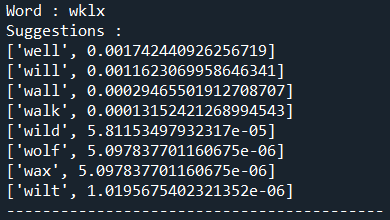
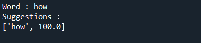

# Word Autocorrect Using Probabilistic Model
**Build a probabilistic model that can suggest set of correct words that can replace incorrect given word and order them from highest probability corrected word to the lowest.**
# Dataset
**Using 6 harry potter novels as dataset resource.**

# Examples

